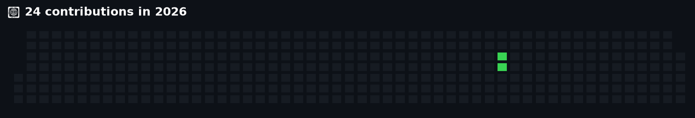
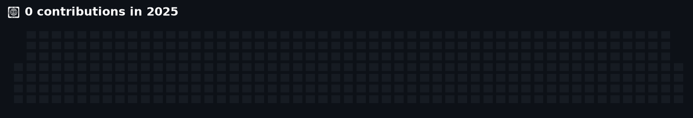
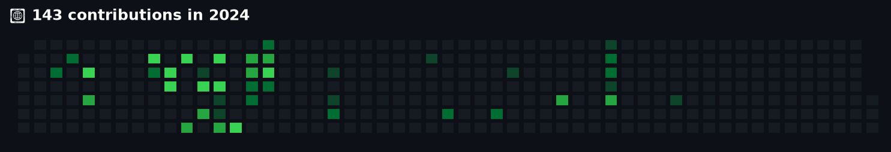
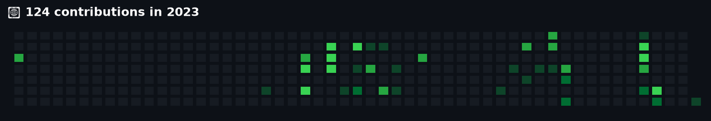

# Muhammad Ahmed
### Full-Stack Engineer | Multi-Tenant Architecture Specialist

  
  
  
  

---

## 🎯 Professional Summary
Full-Stack Engineer with 2.5+ years of experience engineering high-performance, multi-tenant enterprise applications across healthcare and tax-benefit domains. Expertise in **Angular, React.js, Node.js/Express, and PostgreSQL**. Proven track record of accelerating API performance by 60%, architecting multi-tenant data isolation systems, and driving technical execution alongside CTOs while reviewing code for junior developers.

## 🛠️ Technical Arsenal

  
  
  
  
  
  

  
  
  
  

  
  
  
  

  
  
  
  
  

---

## 🏢 Corporate Experience & Impact
*Sorted by most recently updated. Click to expand contribution heatmaps.*

### 🏢 Beyond Solutions

  
<strong>📊 View 3 Contribution Heatmaps (2024-2026)</strong>

   

  **Beyond Solutions (2024)**

  

  **Beyond Solutions (2025)**

  

  **Beyond Solutions (2026)**

  

👉 **[View Technical Deep-Dive, Architecture & Full Commit History](corporate\Beyond_Solutions/README.md)**

---

### 🏢 Tangent Technologies

  
<strong>📊 View 1 Contribution Heatmaps (2026-2026)</strong>

   

  **Tangent Technologies (2026)**

  

👉 **[View Technical Deep-Dive, Architecture & Full Commit History](corporate\Tangent_Technologies/README.md)**

---

## 🟢 Personal Contributions & Open Source

  
<strong>📊 View 4 Personal Contribution Heatmaps (2023-2026)</strong>

   

  **Personal Contributions (2026)**

  

  **Personal Contributions (2025)**

  

  **Personal Contributions (2024)**

  

  **Personal Contributions (2023)**

  

---

## 📄 Full Work History (Text Summary)
**Tangent Tech** | *Full Stack Developer* | `Jan 2026 – Present`
- Developing end-to-end multi-tenant data isolation across Express.js REST APIs and Angular components.
- Mentored 2 junior engineers, enforcing linting rules, and managing 120+ technical tickets in Odoo.

**Beyond Solutions** | *Full Stack Engineer* | `Nov 2024 – Dec 2025`
- Delivered a high-throughput multi-tenant AMR surveillance system adopted across 4 government sectors.
- Engineered database connection pooling, reducing API latency by 60% and handling 25,000+ row reports.

**NESL-IT** | *Technical Project Coordinator* | `Jun 2024 – Nov 2024`
- Orchestrated Agile/Scrum workflows and developed Selenium test automation scripts.

**AB-Matrix** | *Software Engineer (Contract)* | `Sep 2023 – May 2024`
- Migrated legacy cloud infrastructure to AWS, cutting system downtime by 25%.

**Eden Spell** | *Software Engineer Intern* | `Jun 2023 – Aug 2023`
- Developed custom full-stack web applications using PHP, JavaScript, and MySQL.

---

## 🎓 Education & Certifications
- **BS in Software Engineering** | FAST – National University of Computer and Emerging Sciences (2024)
- **Certifications:** Google Project Management Specialization (Coursera) | IBM Web Development Fundamentals

---
*🤖 Portfolio compiled on **2026-09-24**. Personal stats fetched live via GitHub GraphQL API.*
