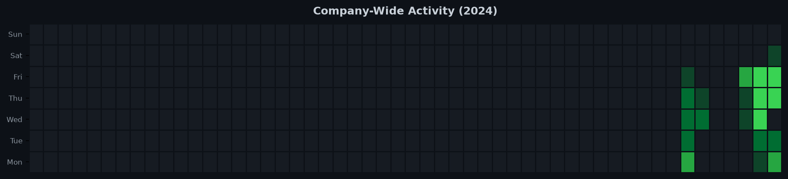
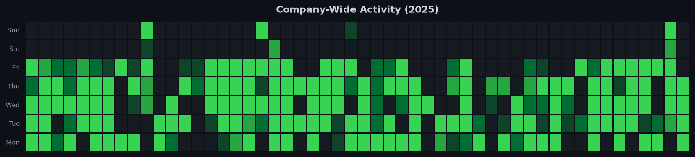
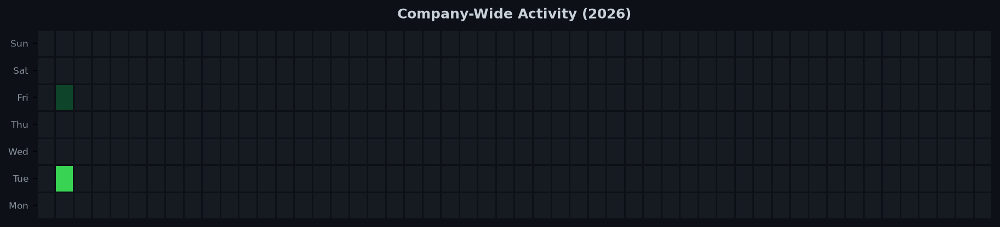

# 🏢 Beyond Solutions - Engineering Impact

*Author: `Muhammad Ahmed` | Period: 2024-11-11 to 2026-01-09*

## 📈 Aggregate Summary Statistics

| Metric | Value |
| :--- | :--- |
| **Total Projects** | `8` |
| **Total Commits** | `1433` |
| **Merges / Reviews** | `152` 🤝 |

## 🟩 Company-Wide Contribution Graphs

### 2024

### 2025

### 2026

##  Project Breakdown & Navigation

| Project | Tech Stack | Commits | Merges | Details |
| :--- | :--- | :--- | :--- | :--- |
| **AMR GB BE** | `axios, express` | 380 | 26 | [📄 View Summary](AMR_GB_BE/README.md) |
| **AMR GB FE** | `@emotion/react, @radix-ui/react-checkbox` | 305 | 33 | [📄 View Summary](AMR_GB_FE/README.md) |
| **AMR KP BE** | `axios, express` | 83 | 11 | [📄 View Summary](AMR_KP_BE/README.md) |
| **AMR KP FE** | `@emotion/react, @radix-ui/react-checkbox` | 70 | 11 | [📄 View Summary](AMR_KP_FE/README.md) |
| **AMR NIH BE** | `axios, express` | 165 | 15 | [📄 View Summary](AMR_NIH_BE/README.md) |
| **AMR NIH FE** | `@emotion/react, @radix-ui/react-checkbox` | 149 | 21 | [📄 View Summary](AMR_NIH_FE/README.md) |
| **AMR SINDH BE** | `axios, express` | 136 | 13 | [📄 View Summary](AMR_SINDH_BE/README.md) |
| **AMR SINDH FE** | `@emotion/react, @radix-ui/react-checkbox` | 145 | 22 | [📄 View Summary](AMR_SINDH_FE/README.md) |

---
*Generated by Corporate Contribution Creator. Raw metadata only. Zero source code included.*