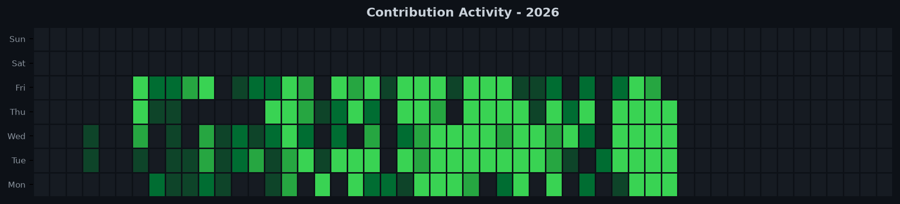

# 📊 ACA Portal BE - Engineering Impact

 &nbsp; 

*Auto-generated on 2026-09-24 23:34:09 | Raw metadata, zero code diffs.*

## 📈 Summary Statistics

| Metric | Value | Metric | Value |
| :--- | :--- | :--- | :--- |
| **Total Commits** | `574` | **Net Lines** | `33342` |
| **Lines Added** | `+42037` | **Files Touched** | `344` |
| **Lines Removed** | `-8695` | **Longest Streak** | `N/A` |
| **Merges / Reviews** | `521` 🤝 | | |

## 🟩 Contribution Graphs

### 2026

## 📦 Core Packages & Dependencies

- `@aws-sdk/client-s3`
- `@google-cloud/functions-framework`
- `@google-cloud/logging-winston`
- `@google-cloud/pubsub`
- `@google-cloud/storage`
- `@sparticuz/chromium`
- `@types/cors`
- `@types/jsonwebtoken`
- `accesscontrol`
- `axios`
- `bcrypt`
- `body-parser`
- `cors`
- `csv-parse`
- `csv-writer`

---
*Raw metadata only. **Zero source code included for NDA compliance.***