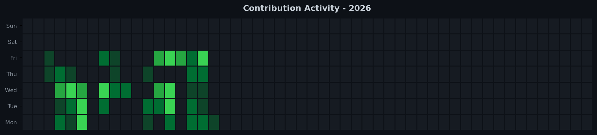

# 📊 WoW Health FE - Engineering Impact

 &nbsp; 

*Auto-generated on 2026-09-24 23:56:26 | Raw metadata, zero code diffs.*

## 📈 Summary Statistics

| Metric | Value | Metric | Value |
| :--- | :--- | :--- | :--- |
| **Total Commits** | `99` | **Net Lines** | `6327` |
| **Lines Added** | `+10770` | **Files Touched** | `6616` |
| **Lines Removed** | `-4443` | **Longest Streak** | `N/A` |
| **Merges / Reviews** | `78` 🤝 | | |

## 🟩 Contribution Graphs

### 2026

## 📦 Core Packages & Dependencies

- `@angular/animations`
- `@angular/common`
- `@angular/compiler`
- `@angular/core`
- `@angular/forms`
- `@angular/localize`
- `@angular/platform-browser`
- `@angular/platform-browser-dynamic`
- `@angular/platform-server`
- `@angular/router`
- `@angular/ssr`
- `@fingerprintjs/fingerprintjs`
- `@fontsource/dm-sans`
- `@ng-bootstrap/ng-bootstrap`
- `@ngx-translate/core`

---
*Raw metadata only. **Zero source code included for NDA compliance.***